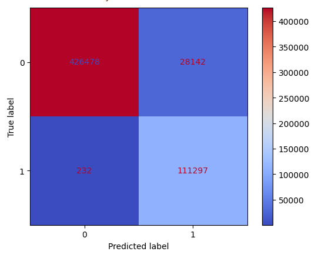
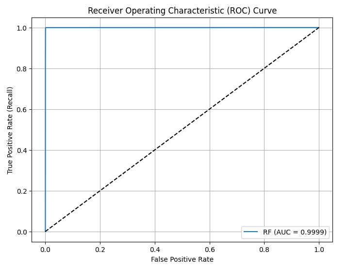

# NetAegis

**Hybrid Machine Learning-Based Anomaly Detection in Network Traffic**

NetAegis is a web-based Intrusion Detection System (IDS) that combines **Isolation Forest** and **Random Forest** models to detect both known and unknown network attacks. Built with a **React.js frontend** and a **Flask + Python backend**, it enables users to upload CSV files containing network traffic parameters and receive real-time predictions.

---

## Key Features

- **Hybrid Detection**: Merges anomaly detection and supervised classification to identify a broad range of attack types.
- **High Accuracy**: Achieves 99% accuracy for known attacks using Random Forest and 95% overall when combined with anomaly detection.
- **Reduced False Alarms**: The hybrid design significantly lowers false positives compared to using either model alone.
- **User Interface**: CSV files can be uploaded through a responsive web frontend, returning classifications as *Benign*, *Anomalous*, or a specific *Attack Type*.

---

## Tools and Technologies

- **Frontend**: React.js, HTML5, CSS3, JavaScript  
- **Backend**: Python, Flask, Scikit-learn, Pandas, NumPy  
- **Dataset**: CIC-IDS 2017 (includes various real-world attack types and benign traffic)

---

## Performance Summary

| Model             | Accuracy | False Positive Rate | Notes                             |
|------------------|----------|---------------------|-----------------------------------|
| Random Forest     | 99%      | Very Low            | Classifies known attack types     |
| Isolation Forest  | 95%      | Low                 | Flags unseen/novel attacks        |
| Hybrid Model      | ~95%     | Lowest overall      | Combines benefits of both models  |

---

## Results

### Confusion Matrix

---

### ROC-AUC Curve

---

## Future Scope

- Real-time traffic capture using packet sniffers (e.g., Scapy, Tshark)
- Integration of temporal models (e.g., LSTM) with timestamped network logs
- Alert system for automatic notifications
- Dashboard with live statistics and visualizations

---

## Proof of Concept

- Dataset: CIC-IDS 2017
- Metrics: Accuracy, Precision, Recall, F1-Score, ROC-AUC
- Demonstrated via web interface with user-uploaded network traffic
- Models tested on unseen data to validate generalization

---
**Suggestions, improvements, and feedback are welcome to enhance the project further !**
